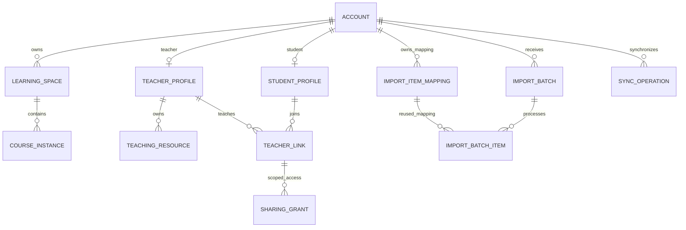

# 账号、本地学习与同步数据设计

日期：2026 年 10 月 2 日。

状态：逻辑数据与流程设计草案，尚未实现。本文件落实学生／教师两类账号、访客本地学习、登录关联与同步要求；数据库产品、最终表结构、字段类型、索引及迁移脚本在实现设计中确定。

## 1 PRD 与数据设计各写什么

PRD 写明账号类型、数据归属、未登录学习、登录后的关联与同步、教师权限、失败行为和验收条件，也应列出主要数据对象及关系。物理表结构、字段、索引、事务、存储选型、同步接口和迁移脚本在本文件或后续技术设计中细化，不把 SQL 塞进产品需求。

本文件的实体名称为建议，不能当作已存在的数据库。完整学习对象继续以 [PRD](PRD.md) 和 [活动契约](LEARNING_LOOP_DESIGN.md) 为依据，本次重点确定身份、归属与同步边界。

## 2 两类账号分别管理

账号类型明确为学生和教师，各自拥有资料、业务入口与权限。建议使用公共认证身份，加独立的学生资料和教师资料；角色业务数据分别组织，物理拆库与部署方式后续确定。

- 学生账号管理自己的课程、目标、作品、尝试、帮助、证据和教师关联。
- 教师账号管理自己的教学资料、课程任务、核验标准和反馈，仅访问学生授权的范围。
- 教师也可自学：其访客学习记录关联本人账号的个人学习空间，与备课、发布和学生授权视图分开；这不会增加学生管理或其他账号权限。
- 初版一个账号具有一种明确类型，服务端校验类型与角色资料匹配。账号类型、教师身份核实状态和管理权限不通过学习数据导入修改。内容维护和管理属于另外授予的权限。

学生和教师数据分别管理不改变个人作品的所有者。学生关联教师后，自己的学习数据仍归自己；不能复制成教师名下的学生成绩或默认公开全部历史。

## 3 三种数据空间

| 空间 | 持久保存位置 | 归属与使用 |
|---|---|---|
| 未绑定访客学习空间 | 当前浏览器／客户端 | 本地空间标识，无账号所有者；可开始、学习、记录和返回继续 |
| 已关联账号的本地空间／缓存 | 当前浏览器／客户端，按账号隔离 | 已有明确账号归属，包括尚未上传的作品和离线修改 |
| 账号云端空间 | 服务端业务存储及附件存储 | 当前认证账号的个人或教学数据，可在其他设备同步；访问仍按权限处理 |

本地空间标识不是服务器账号，也不能作为访问云端的授权凭据。不同访客空间和账号缓存不能仅靠课程名称混合。公共课程模板与个人课程实例分别保存，多个学生引用同一模板不共享私人尝试。

### 3.1 本地存储建议与限制

浏览器端建议用 IndexedDB 保存结构化记录和适量附件，客户端通过相同存储接口保存至本地数据库与文件。具体客户端运行形态尚未选定，不在本次承诺已有桌面应用。IndexedDB 支持结构化对象、事务和文件／Blob，但仍受浏览器存储管理限制。[IndexedDB 文档](https://developer.mozilla.org/en-US/docs/Web/API/IndexedDB_API)

提供容量状态、导出／导入和主动清理入口；本地写入失败须明确提示，不显示“已保存”。浏览器可能回收存储，清理站点数据或结束隐私会话也可能丢失记录；可申请持久存储并报告实际结果，不能承诺一定获准或永不丢失。[存储配额与回收](https://developer.mozilla.org/en-US/docs/Web/API/Storage_API/Storage_quotas_and_eviction_criteria)、[持久存储请求](https://developer.mozilla.org/en-US/docs/Web/API/StorageManager/persist)

本地仅按账号划分产品访问范围，不宣称同一系统用户无法用浏览器存储工具读取缓存。共享设备退出时提供保留本机记录或清理的选择；有未同步数据时说明影响并提供导出，不静默删除。

### 3.2 未登录的在线工具

未登录不等于所有功能离线运行。模型、编译器、数据库或网络实验可以临时处理当前任务输入，但学习历史、作品、证据和进度只在本地持久保存，不建立匿名账号或长期访客学习档案。

访客远程任务使用短期会话与任务标识，临时工作目录、材料索引、输入、输出和实验资源按任务生命周期清理。服务端学习内容不进入长期数据库、备份、对象存储或完整请求日志；运行所需的短期暂存及实际期限须明确。第三方模型与执行服务的处理／保留条件也需核对，不能用外部服务暗中长期存档。

结果尽快返回本地保存，远程任务到期或服务重启后可能需要重建或重跑，客户端保留已有作品和已取得的证据。可查询、取消、限额和清理按访客模式实现，不能以账号模式的持久任务机制违背“未登录只本地保存”。

断网时可继续已缓存资料、编辑和保存；需要远程计算的步骤显示待联网，不伪造结果。离线功能范围取决于实际缓存与环境，不能把无需登录写成全部实验均可离线。

## 4 登录并承接本地学习记录

正常流程不要求重新开始课程。登录入口说明“登录并关联本机未绑定学习记录”，展示当前访客空间与记录范围；认证成功后自动承接该空间，并在联网时后台同步。一次明确的登录承接动作即可表达关联意图，不再重复确认。已有其他账号归属的缓存不在承接范围内。

1. 完成认证，确定实际账号及类型，不能在登录未成功时关联数据。
2. 针对本次选择的未绑定空间，在本地事务中记录所属账号和关联操作标识；并发标签页不能把同一空间关联到不同账号。
3. 在线时建立云端导入批次和稳定对象映射；尚未上传时仍显示“已关联，待同步”，允许继续学习。
4. 分批提交课程、活动、作品、尝试、证据及附件，保存每项确认和失败，按依赖关系补传。
5. 读取账号已有记录并分别显示；按稳定标识关联，不根据同名课程或客户端时间戳覆盖已有历史。
6. 整个选定范围确认成功后才显示“已同步”。本地原件不会因提交请求或部分成功而删除。

建立归属和上传完成是不同状态。状态至少包含未绑定、关联中、已关联待同步、同步中、部分完成、已同步、失败／冲突，并分别显示当前归属和上传进度。

教师账号承接本人访客记录时进入个人学习空间；关联操作不能把它们变成教学模板、某个学生的成绩或教师可见的学生名单。

### 4.1 退出和切换账号

退出账号 A 后，其缓存和待同步修改仍属于 A，并停止该账号同步；新的未登录学习进入新的未绑定访客空间。账号 B 登录只能承接所选择的未绑定空间，不能认领、查看或上传 A 的缓存。

异步任务始终绑定启动时的空间、作品版本和账号上下文。A 的旧标签、待同步队列或迟到结果不能在 B 登录后写入 B；重新认证 A 后才继续 A 的同步。多标签页同步归属与登录状态，收到退出或切换事件后停止旧上下文的操作。

同步请求携带期望账号用于校验；服务器写入身份以认证上下文为准，并拒绝期望账号与实际账号不匹配的旧请求。这个校验不能变成允许客户端任意指定所有者的接口。

## 5 同步规则

| 数据类型 | 同步方法 | 冲突与边界 |
|---|---|---|
| 新课程与个人活动 | 稳定标识和跨批次导入映射 | 重试或重建批次不重复创建同一来源对象；同名但不同标识默认保留为不同实例 |
| 尝试、帮助、运行结果与证据 | 追加记录和必要的修订关系 | 不用覆盖历史的方式修正；相同操作重试不重复增加 |
| 源码、推导、图表与项目作品 | 不变的作品版本与父版本关系 | 并行修改保留双方版本，允许选择或合并，不按设备时间静默覆盖 |
| 目标、路线与当前恢复位置 | 基准版本校验和变更记录 | 实质冲突显示差异并提供选择；当前进度不以最大完成率粗暴合并 |
| 附件与大文件 | 元数据、内容标识、分批上传及确认 | 上传失败保留待传状态；元数据成功不代表文件也已成功 |
| 删除与撤销 | 有版本的删除标记／撤销记录 | 老设备回传不能复活已删除对象或已撤销授权；过期设备需重新校核 |

本地采用稳定设备、空间、对象和操作标识；服务器验证归属、结构、版本、引用关系与配额。一个批次可以部分成功，每项都可重试，进度推进只由业务核验触发，不由上传次数触发。

对象映射以目标账号、稳定来源空间、对象类型及来源对象标识保持唯一，跨批次复用；来源设备记录原来源，不因从另一设备重试而改变对象身份。批次处理结果与永久映射分别保留。内容相同但来源标识不同的尝试仍分别保存，不能仅按内容哈希去重学习过程。

账号模式下同步成功的数据可跨设备恢复；新设备未取得的文件或仅本地存在的修改明确显示。短期实验环境本身不随同步完整搬迁，使用保存的材料和配置重建，再重新检查。

## 6 来源与核验可信度

本地记录可以被修改、导入或复制，因此保留客户端来源、原时间、环境、帮助和缺失项。同步是归属和保存操作，不是学习成果认证。

- 导入时保留历史“通过”记录及原来源，但客户端字段不能直接写入平台可信核验、独立完成或掌握状态。
- 平台执行器的可验证原始结果与客户端自述分开；必要时验证平台签发的结果凭据或重新执行。具体凭据机制待实现，不因写入本文件宣称现有结果可验证。
- 无法确认时显示本地记录／待核验，保留作品和学习路线，允许补核验或继续其他学习。
- 教师看到证据时也看到来源及未核验状态；教师反馈记录作者、权限与依据，不能篡改学生原始尝试。

账号类型、教师核实状态、管理权限、其他账号所有者、分享授权及平台核验字段不能随一般学习导入写入。

## 7 教师关联与共享

推荐默认路径为教师定向邀请、学生看清教师身份、课程与共享范围后接受即生效；学生主动申请时，教师接受后生效。记录双方动作与学生授权，等待或拒绝不影响自主学习。这是本轮待选定的建议，具体界面在用户流程设计中细化。访客先保存本地学习，登录后再进行账号与教师关联。

建立关系和授权共享是两件事，可以在一次清楚说明范围的加入动作中完成。分享授权限定接收教师、课程／活动或证据范围、可见信息、反馈权限及有效状态；默认不开放全部个人历史、私有资料或其他课程。

推荐初版按课程授权，显示包含的已有记录及此后同范围的新提交。共享目标、任务、主动提交的作品、对应核验与来源、帮助摘要、待核验项与求助；未提交草稿、完整聊天或额外课程另行分享。订阅不增加教师读取范围，也不改变学习数据所有者。

教师只得到授权视图，学生仍为学习数据所有者。授权同样覆盖检索、文件下载、统计与 Agent 工具；不能只隐藏页面按钮。

解除关系或撤销授权后停止新的读取与共享，学生自己的作品、证据和已收到的反馈保留来源。已经导出的副本无法靠撤销操作保证收回，分享界面需要说明这一实际边界。

## 8 建议逻辑实体

| 实体 | 关键字段或关系 | 约束与用途 |
|---|---|---|
| `account` | 账号标识、类型、认证关联、状态 | 认证身份与服务端权限入口；类型仅学生／教师 |
| `student_profile` | 学生账号标识、学生资料 | 只关联学生类型账号，分别管理 |
| `teacher_profile` | 教师账号标识、教师资料、身份核实状态 | 只关联教师类型账号，不能由学习同步授予权限 |
| `learning_space` | 空间标识、所有者账号、来源空间、版本 | 云端每个空间有明确所有者；本地访客空间尚无账号归属 |
| `course_instance` | 所属空间、引用课程内容版本、个人目标与恢复位置引用 | 与公共或教师课程模板分开 |
| 学习对象集合 | 目标、活动、尝试、作品版本、帮助、核验和证据分别关联空间与课程 | 后续分别细化实体、版本和引用，不能只同步聊天文本 |
| `teaching_resource` | 所属教师、内容版本、发布范围 | 与教师个人学习作品及学生尝试分别管理 |
| `teacher_link` | 学生账号、教师账号、课程范围、状态、创建与解除时间 | 双方类型和关联状态校验；不等同全面授权 |
| `sharing_grant` | 授权者、接收教师、对象范围、操作权限、状态与版本 | 接收者必须是相应教师；撤销可传播 |
| `import_batch` | 目标账号、来源设备／空间、操作标识、版本、进度与错误 | 只在登录关联后建立；保存同一批次的恢复状态 |
| `import_item_mapping` | 目标账号、来源空间、对象类型与标识、来源设备、云端对象与版本 | 跨批次永久映射，防重复创建及跨空间错误引用 |
| `import_batch_item` | 批次、对象映射引用、处理状态、确认版本与错误 | 同一对象在多个批次处理时保留各次结果，不重复生成云端对象 |
| `sync_operation` | 期望账号、设备、操作标识、对象、基准版本、结果 | 服务端认证校验；可重试、幂等和冲突检测 |
| `attachment` | 所属空间或教学资源、内容标识、位置、大小、版本、上传状态 | 私有文件继承权限；部分上传不算完成 |
| 同步变更与删除记录 | 所属账号范围、顺序游标、对象版本、删除／撤销状态 | 跨设备增量读取；过期游标需要重新校核 |

图中学生／教师资料为互斥类型，账号类型、资料与关联双方在服务端和事务中保证一致；个人学习空间可属于任一类型。授权仍须关联有效对象范围，图中的关系不能单独代替权限校验。

### 8.1 唯一性与版本要求

- 角色资料与账号一一对应，且符合账号类型；教师关联的学生端与教师端分别约束。
- 目标账号、来源空间、对象类型和来源对象标识的映射唯一，跨批次及设备重试稳定；重复操作返回已确认结果，不重复生成对象。
- 同步操作在账号和设备范围唯一；重复标识却提交不同内容时拒绝，不覆盖原操作。
- 各对象记录版本；修改需校验基准版本，关联对象应属于允许的同一空间或已授权公共资源。
- 创建或导入个人对象时，所有者从认证上下文确定；操作既有对象须校验原归属，不重写所有者。教师反馈的作者来自教师认证，目标学习数据仍归学生；历史来源账号字段仅用于校验，不允许转移别人的云端对象。
- 账号、课程与授权过滤覆盖查询、附件、检索和 Agent 输入；账户类型不授予对全体同类型数据的访问。

这些约束后续落实为数据库约束、服务端检查、事务、索引和同步测试，当前不提供未经运行的建表脚本。

## 9 验收场景

1. 未登录建立目标，完成代码或实验活动，刷新后恢复本地作品、帮助和证据；无长期访客学习档案。
2. 本地存储不可用或超限时明确告知，能导出已有记录，不虚称保存成功。
3. 登录学生 A，关联当前访客空间并分批同步；刷新、断网或重复点击后无重复课程与尝试。
4. 元数据成功而附件失败，显示部分完成，保留本地文件并能继续补传。
5. A 退出后 B 登录，A 缓存与待同步记录不被展示、认领或写入 B；迟到响应和旧标签也不串号。
6. 两个标签页并发关联、修改和退出，归属一致；并行编辑保留冲突版本。
7. 已同步账号换设备后恢复已取得的作品；仅本地的修改和缺失附件明确标识。
8. 教师登录承接自己的学习记录，进入个人学习空间；学生与教学数据仍分别管理。
9. 关联教师只共享明确范围，未授权课程、私有附件、检索和 Agent 调用不可访问；撤销后停止新访问。
10. 篡改本地类型、所有者、授权或“已通过”字段再同步，不能取得权限或生成可信核验结论。
11. 删除或撤销后旧设备同步，不复活对应对象或共享权限。
12. 访客远程任务到期或重启后清理，客户端已有证据保留，能说明需要重建／重跑的部分。

以上测试尚未运行。上线前还需确定本地与云端配额、临时资源清理期限、账号认证与教师身份核实方式、附件存储、同步变更保留与过期处理，以及现有数据迁移方案。
