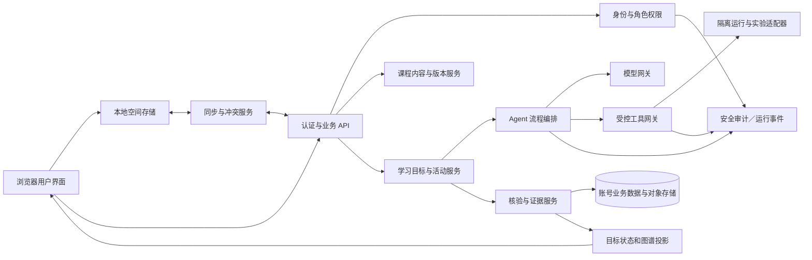

# 系统架构与信任边界

版本：v0.1

状态：开发前逻辑架构草案；语言、供应商、数据库和托管细节须经实现约束验证。对应产品范围见 [PRD](PRD.md)。

## 1 设计目标

实现未登录本地学习和登录后同步，支持学生／教师不同空间、多课程版本、按需 Agent 协作、真实工具执行、可信证据写入以及 CS01–CS13 全量课程。网页节点状态不得绕过服务端授权、证据校验或课程版本检查。

## 2 逻辑组件

## 3 责任边界

| 组件 | 负责 | 禁止事项 |
|---|---|---|
| 用户界面 | 显示课程与权限过滤后的证据、编辑作品、提交动作、报告本地保存与云端同步状态 | 自行认定身份／所有者、签发可信核验、把过滤结果改为整课分母 |
| 本地空间 | 匿名／账号隔离命名空间保存未上传记录、版本和待同步操作 | 由本地记录冒充服务端验证；登录其他账号后改写原所有者 |
| 认证与授权 | 验证会话和角色；每次读取、修改、检索和工具调用按服务器端所有权和授权复核 | 信任客户端角色、缓存授权、教师关系或请求中的账号字段 |
| 课程服务 | 发布不可变版本的完整课程蓝图、目标、关系、资料和活动标准 | 静默替换既有版本；将未审内容显示为已支持 |
| 学习服务 | 管理当前目标、任务与活动、恢复位置、帮助规则和学习状态变更请求 | 将模型输出或按钮点击直接升级为达标证据 |
| Agent 编排 | 按工作流契约选择规划、辅导、任务、核验和按需设计职责；管控步骤、上下文、工具和预算 | 让 Skill 或模型自行改权限、查看无权资料或写入可信状态 |
| 模型网关 | 配置和调用模型、耗时／用量、超时重试、脱敏策略和服务商边界 | 返回伪造工具结果；日志中无限期保留受限制访客输入 |
| 工具网关与隔离执行 | 以版本固定运行镜像、配额、输入／输出界限及网络策略；产生可验证工具结果 | 在业务服务进程运行不可信代码、开放控制面凭据或无限外网 |
| 核验与证据 | 固定输入作品、条件、标准版本、角色帮助和环境结果，校验后以事件更新受影响目标 | 信任客户端分数、迟到的不同版本任务、相关边自动传播掌握 |
| 同步服务 | 验证空间归属、幂等、增量游标、冲突和删除传播；报告逐对象状态 | 账号切换后搬运异主队列；只凭导入声称证据可信 |
| 事件与运维 | 维护审计、错误诊断、容量和版本信息；按存留规则清理访客载荷 | 保存无关原始教学私密内容作为默认诊断日志 |

## 4 数据流与证据写入

请求携带认证会话、空间、目标／活动版本和稳定请求 ID。后端基于会话解析账号与所有者，读取当前授权和课程／答案策略；模型只收到按规则筛选、必要的上下文。任何外部工具调用先过类型化工具接口及隔离策略。Agent 产物是建议；学习服务确认学生已提交匹配的作品版本，核验服务取得实际工具结果／审阅依据后追加证据事件。目标状态投影基于当前有效课程版本重新计算并回传界面。

核心事件携带 `event_id`、`space_id`、`owner_id` 或访客来源、`actor_type`、`activity_version_id`、`artifact_version_id`、标准版本、证据来源、时间与幂等键。访客事件只存本地；远程执行收到短期运行 ID，不因此取得访客空间的长期归属。

## 5 前端／API 持久状态

- 图谱课程结构及公开审校过的活动定义可按版本缓存；学生证据须独立按授权身份缓存。
- UI 展开、缩放、选中、过滤和位置是展示偏好，不写入学习证据或课程总分母。
- Agent 运行、执行任务、等待学生输入、待核验、已取消及失败须为显式状态；重复请求须幂等。
- 旧版本尝试和答案策略可回看其当时依据；新版本只能依等价映射承接对应证据。
- 课程内容与学生实例分开存储；模板不可直接包含其他学生作品。

## 6 运行与扩展决策

Web、本地存储、API、模型调度器、课程审核工具、隔离执行器和对象存储均需保留可替换边界。LangGraph 为候选自托管编排实现，须在 [架构决策记录](ARCHITECTURE_DECISIONS.md) 核对恢复、人工等待、并发、版本兼容和许可后锁定。MVP 与第一阶段里程碑按 [开发计划](DEVELOPMENT_PLAN.md)；13 门全量课程是第一阶段门槛。

精确编程语言补丁、隔离技术、并发与运行时限、数据库及云端实现以架构决策记录和验收结果为准，本文件不表示它们已经部署。
