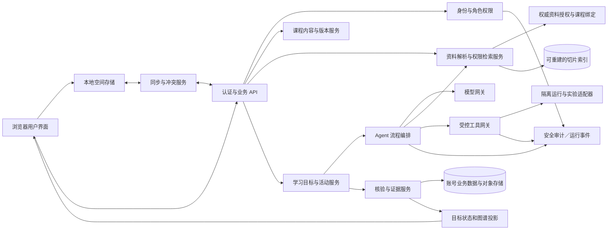

# 系统架构与信任边界

版本：v0.2

状态：开发前逻辑架构草案；语言、供应商、数据库和托管细节须经实现约束验证。对应产品范围见 [PRD](PRD.md)。

## 1 设计目标

实现未登录本地学习和登录后同步，支持学生／教师不同空间、多课程版本、按需 Agent 协作、真实工具执行、可信证据写入、CS01–CS13 平台默认全量课程和教师自建课程。课程 ID 不限定为默认课程编号；自建课程使用独立、经教师确认的范围与深度计算图谱和进度。网页节点状态不得绕过服务端授权、证据校验或课程版本检查。

## 2 逻辑组件

## 3 责任边界

| 组件 | 负责 | 禁止事项 |
|---|---|---|
| 用户界面 | 显示课程与权限过滤后的证据、编辑作品、提交动作、报告本地保存与云端同步状态 | 自行认定身份／所有者、签发可信核验、把过滤结果改为整课分母 |
| 本地空间 | 匿名／账号隔离命名空间保存未上传记录、版本和待同步操作 | 由本地记录冒充服务端验证；登录其他账号后改写原所有者 |
| 认证与授权 | 验证会话和角色；每次读取、修改、检索和工具调用按服务器端所有权和授权复核 | 信任客户端角色、缓存授权、教师关系或请求中的账号字段 |
| 课程服务 | 管理平台默认／教师自建来源、所有者、独立范围、能力检查和发布受众；发布不可变课程蓝图、目标、关系与活动标准 | 静默替换既有版本；将未审内容显示为已支持；以创建课程声称实验环境已具备 |
| 资料解析与检索 | 保留原件／解析／切片版本与页码定位；按每个课程绑定的可见性、受众和目的检索，维护可重建索引 | 以向量索引内 ACL 代替权威授权；跨课程沿用可见性；通过原件、缓存、记忆或 Agent 转交绕过限制 |
| 学习服务 | 管理当前目标、任务与活动、恢复位置、帮助规则和学习状态变更请求 | 将模型输出或按钮点击直接升级为达标证据 |
| Agent 编排 | 按工作流契约选择规划、辅导、任务、核验和按需设计职责；管控步骤、上下文、工具和预算 | 让 Skill 或模型自行改权限、查看无权资料或写入可信状态 |
| 模型网关 | 配置和调用模型、耗时／用量、超时重试、脱敏策略和服务商边界 | 返回伪造工具结果；日志中无限期保留受限制访客输入 |
| 工具网关与隔离执行 | 以版本固定运行镜像、配额、输入／输出界限及网络策略；产生可验证工具结果 | 在业务服务进程运行不可信代码、开放控制面凭据或无限外网 |
| 核验与证据 | 固定输入作品、条件、标准版本、角色帮助和环境结果，校验后以事件更新受影响目标 | 信任客户端分数、迟到的不同版本任务、相关边自动传播掌握 |
| 同步服务 | 验证空间归属、幂等、增量游标、冲突和删除传播；报告逐对象状态 | 账号切换后搬运异主队列；只凭导入声称证据可信 |
| 事件与运维 | 维护审计、错误诊断、容量和版本信息；按存留规则清理访客载荷 | 保存无关原始教学私密内容作为默认诊断日志 |

## 4 数据流与证据写入

请求携带认证会话、空间、目标／活动版本和稳定请求 ID。后端基于会话解析账号与所有者，读取当前授权和课程／答案策略；模型只收到按规则筛选、必要的上下文。任何外部工具调用先过类型化工具接口及隔离策略。Agent 产物是建议；学习服务确认学生已提交匹配的作品版本，核验服务取得实际工具结果／审阅依据后追加证据事件。目标状态投影基于当前有效课程版本重新计算并回传界面。

核心事件携带 `event_id`、`space_id`、`owner_id` 或访客来源、`actor_type`、`activity_version_id`、`artifact_version_id`、标准版本、证据来源、时间与幂等键。访客事件只存本地；远程执行收到短期运行 ID，不因此取得访客空间的长期归属。

### 4.1 教师自建与资料处理

课程创建生成稳定 `course_id`，记录 `platform_default`／`teacher_custom` 来源、服务端解析的所有者及发布范围。教师可上传大纲、PPT 和其他资料，按需设计 Agent 辅助生成范围、图谱、目标与活动草案；发布前由教师确认版本，并检查每个实践活动的工具能力、核验方式及环境限制。教师自建的 `teacher_reviewed`／`scope_published` 状态与平台默认的内容审校／课程验收状态分开，不强制自建课程先进入官方目录才能教学。复制课程不复制他人的私人作品、资料授权或未授予的运行能力。

原件生成不可变资料版本；解析、切片和索引均带来源 hash、解析器配置版本和定位信息。教师资料及其新课程绑定默认教师私有；复用到另一课程必须单独建立授权绑定。教师可在绑定上选择学生可见并指定受众；课程可加入学生，不意味着全部资料自动可见。未解析／解析失败／撤回／删除状态均明确显示，未就绪切片不得作为可检索证据。

上传支持 `.ppt`／`.pptx`、PDF、DOCX、TXT 与 Markdown，旧 `.ppt` 经受控转换后解析。发布预览须提示备注、隐藏页、嵌入附件以及扫描件／图表解析遗漏；若学生不能查看原件部分内容，生成并审阅独立学生副本，对该副本建立切片和下载授权，不能仅过滤索引后仍开放完整原件。

### 4.2 RAG 信任边界

教师备课与学生问答是不同的检索目的，服务端从认证身份、业务入口和课程授权确定可信目的；请求体的 `owner`、角色、可见性或目的不能提升权限。学生检索只接受其有权进入的课程／发布实例中，教师已选择学生可见、当前版本有效且已解析就绪的绑定；检索内容同时受任务答案开放策略限制。教师私有资料不能作为学生问答、学生 Agent 或对学生工具输入的上下文，即使输出不显示引用也不得提供。

检索先按权威 ACL 计算允许范围，再在范围内召回；命中后加载原件／切片、交给 Agent 前及发出答案／流式片段前再次核对最新权限与答案策略。权限服务不可用或版本无法核实时拒绝提供受限内容。上下文、对话摘要、Agent 共享记忆、完整答案、下载链接和结果缓存都按相同边界分区，不允许依靠旧缓存或旧运行恢复已撤销的访问。

资料撤回、删除、学生可见关闭、课程受众撤权须首先在权威授权记录生效，阻断后续读取与发出；随后可靠事件异步清理索引、缓存和待用上下文，并对账重试。异步清理未完成不形成访问宽限期。缓存命中仍需复核当前授权；索引和结果记录携带资料版本、绑定 ID 和授权修订，便于失效定位。已实际发出的内容无法收回，系统不得承诺撤权能删除学生已获得的副本。

基于教师私有来源生成的课程内容、题目、答案或 Skill 默认仍是教师草案。要成为学生可见派生产物，须记录来源、由教师明确审阅并发布为独立版本，复核敏感内容与答案规则；发布仅授权该产物，不公开原件或私有切片。派生产物的有效发布授权须独立可撤销，隐藏引用不构成资料保护。

处理细则见 [资料与 RAG 设计](RAG_AND_RESOURCE_DESIGN.md)；对应产品要求为 FR44–FR46。

## 5 前端／API 持久状态

- 图谱课程结构及公开审校过的活动定义可按版本缓存；有受众限制的课程资料、派生产物和学生证据须独立按授权身份／范围缓存，并在访问时复核最新策略。
- UI 展开、缩放、选中、过滤和位置是展示偏好，不写入学习证据或课程总分母。
- Agent 运行、执行任务、等待学生输入、待核验、已取消及失败须为显式状态；重复请求须幂等。
- 旧版本尝试和答案策略可回看其当时依据；新版本只能依等价映射承接对应证据。
- 课程内容与学生实例分开存储；模板不可直接包含其他学生作品。

## 6 运行与扩展决策

Web、本地存储、API、模型调度器、课程审核工具、隔离执行器和对象存储均需保留可替换边界。LangGraph 为候选自托管编排实现，须在 [架构决策记录](ARCHITECTURE_DECISIONS.md) 核对恢复、人工等待、并发、版本兼容和许可后锁定。MVP 与第一阶段里程碑按 [开发计划](DEVELOPMENT_PLAN.md)；13 门全量课程是第一阶段门槛。

精确编程语言补丁、隔离技术、并发与运行时限、数据库及云端实现以架构决策记录和验收结果为准，本文件不表示它们已经部署。

课程与检索模块不得将 CS01–CS13 硬编码为合法课程全集。解析器、切片策略、全文／向量索引与 ACL 存储具体产品仍待架构决策；任何选型必须验证课程级授权、撤权即时拒绝及全链路防泄漏。

受控答案在资料、切片和派生产物上保留原发布实例／策略关联，课程问答无任务、改换任务、下载及导出均按该关联检查；无关联自学不受扩大限制。独立审阅发布物校验自身发布授权，未发布摘要／缓存继承全部受限来源；原件撤回只失效原件及未独立发布依赖，界面提供同步撤回相关独立发布物的选择。
