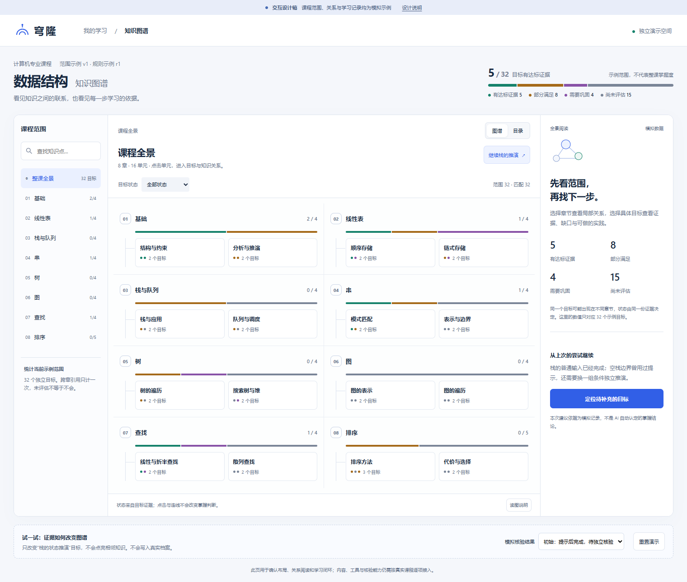
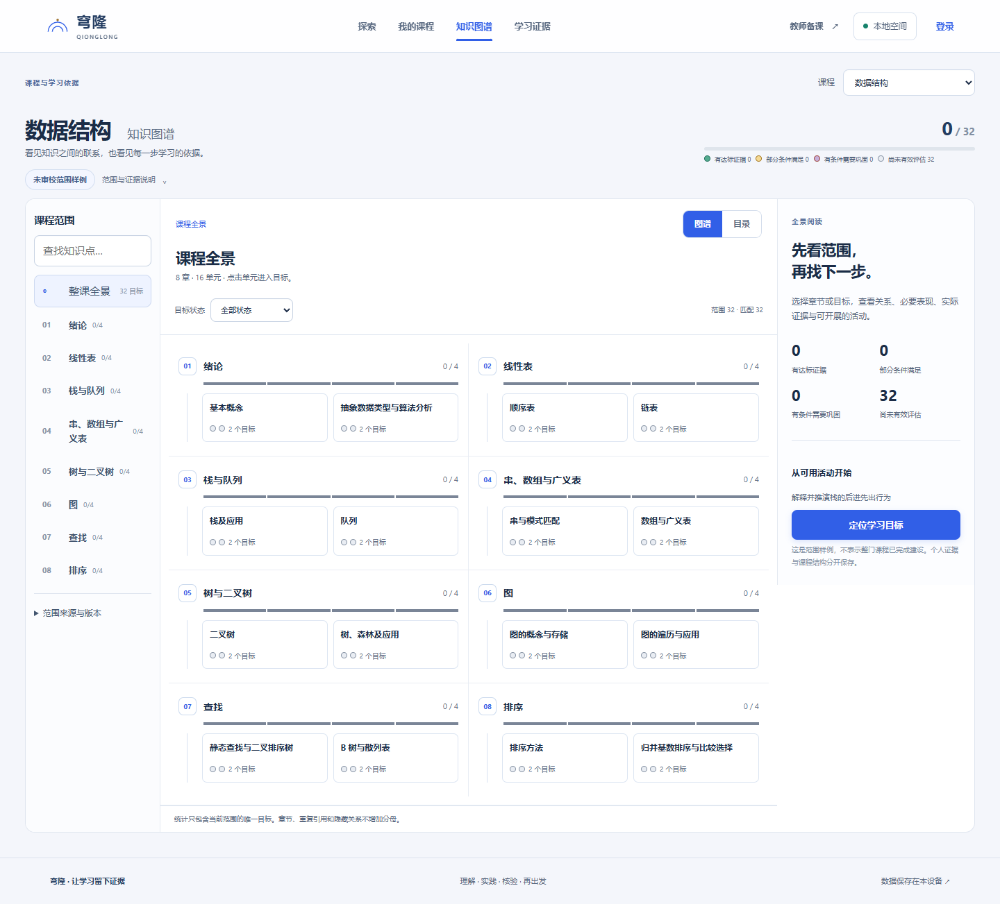
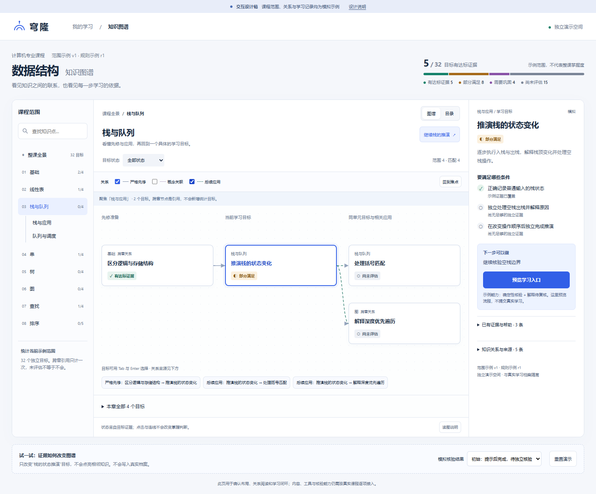
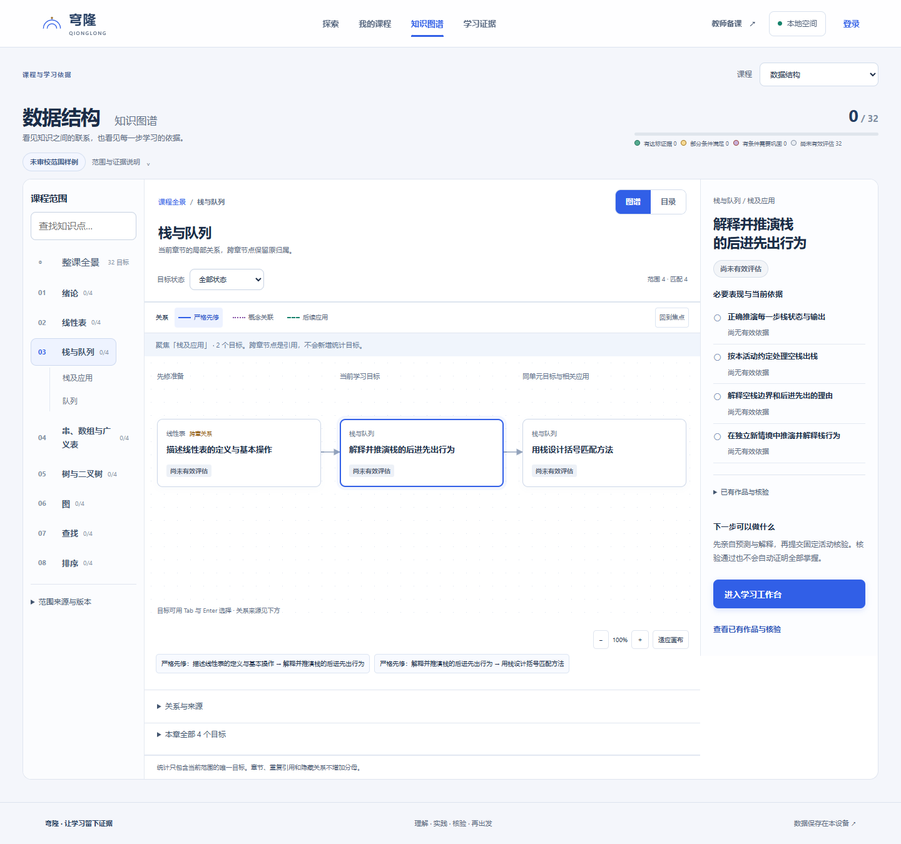

# 知识图谱设计稿对照记录

日期：2026-10-08。第三轮按原稿校正，替代第二轮的圆形章节区域方案。原稿数据是模拟数据，正式截图使用访客空档案；颜色分布与达标数不同是数据事实，不通过生成记录消除这个差异。

| 对照项 | 原稿行为 | 本轮正式实现 |
|---|---|---|
| 全景 | 章节网格、单元入口、分布条 | 两列章节网格；宽屏可四列，手机单列 |
| 章节进入 | 保留本章合法当前目标，否则选首个匹配目标 | 恢复同一规则，选择单元时只保留本单元合法目标 |
| 局部范围 | 当前目标、同单元目标、当前目标直接关系 | 不再混入整章队列分支；本章完整列表按需展开 |
| 节点 | 可读文字卡片、当前目标描边 | 移除圆点与缩小标签；默认 100% 显示文字卡片 |
| 关系 | 严格先修、概念关联、后续应用 | 真实声明关系；有向箭头与无向虚线区分，说明可点选 |
| 返回 | 面包屑回课程全景 | 点击课程全景清除章节与目标，浏览器历史可恢复 |
| 证据 | 模拟条件、帮助记录、下一步 | 真实条件与作品记录；当前无证据保持未评估 |
| 手机 | 三组卡片纵向展示、详情在下方 | 可读卡片按组排列；目录可折叠，不把桌面缩小成细字地图 |

## 全景原稿

## 全景当前实现

## 局部原稿

## 局部当前实现

## 保留的实际差异

正式应用需要课程切换与全局导航；目标名称、必要表现与可开展活动来自真实课程包。原稿的模拟五个达标目标、模拟帮助历史和跨章应用样例不能复制为真实结果。默认课程内容与个人课程构建能力仍需独立验收。截图对照用于评审，不等同于用户已经认可视觉效果。
