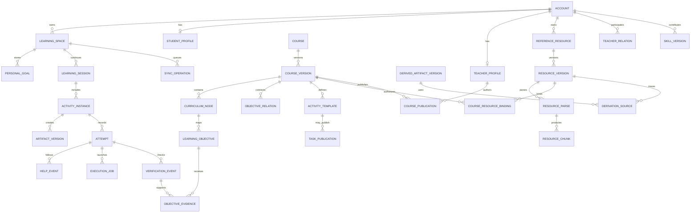

# 数据库与同步核心模式

版本：v0.2

状态：逻辑／概念模型；不锁定数据库产品，不表示 SQL 迁移已实现。产品数据边界和同步规则见 [账号与数据设计](ACCOUNT_AND_DATA_DESIGN.md)。

## 1 统一标识原则

- 每个业务对象使用稳定、不可变 ID；每条可编辑对象有单调版本和创建／更新时间。
- 数据实体归属账号或显式未绑定本地空间；服务器端 owner 是最终权限依据。
- 课程模板、课程版本、个人课程计划、任务发布实例与学生个人作品不可混为一个可变对象。
- 关系引用需指出引用版本；课程范围变化不得无依据改变旧证据适用目标。
- 尝试、帮助、运行、核验和状态变化使用追加式事件或不可变版本；纠正通过新事件表达。
- 删除传播使用有时限规则的 tombstone；删除、撤权与数据保留策略要分别记录。
- 重试安全：`(space_id, op_id)` 唯一；执行／核验 job 和事件有稳定幂等键。
- `course_id` 为开放的业务标识，不以 CS01–CS13 枚举校验；这些编号仅为平台默认课程基线。教师自建课程独立保存来源、所有者、范围、深度和发布受众。
- 内容版本不可变不意味着授权不可变；资料课程绑定及发布授权有独立、单调的策略修订，撤权读取最新权威状态。

## 2 实体关系总览

## 3 逻辑数据字典

| 表／对象族 | 主字段 | 约束与用途 |
|---|---|---|
| `account` | `account_id`, `account_type`, `status`, timestamps | 类型由认证与管理员流程授予；仅一种基础角色类型 |
| `student_profile` / `teacher_profile` | `account_id`, verified/status, profile data | 分角色资料；资料 ID 必须与 account 类型一致 |
| `learning_space` | `space_id`, `owner_account_id?`, `origin_kind`, `status`, version | 访客时无云端 owner；绑定为不可逆归属事件；支持本地 account cache 映射 |
| `course` / `course_version` | stable `course_id`, `origin_kind`, `owner_account_id`, optional baseline code, `version_id`, scope/depth/baseline, workflow state, platform review state, provenance, curriculum ref | `platform_default`／`teacher_custom` 分开；平台默认代码不约束自建 ID；发布内容不可变；独立范围计算进度；教师范围发布不等于平台验收或官方收录 |
| `course_capability_check` / `course_publication` | course/version, activity/tool/verification requirements, check results, teacher confirmation, audience scope, status, `policy_revision` | 环境实测／外部或人工核验路径与限制逐活动记录；发布固定范围和内容版本，受众授权可独立撤销 |
| `curriculum_node` | `node_id`, `course_version_id`, parent, node_type, title, ordering, scope tag | 仅组织层级；不得计作额外可检验目标；唯一父关系需无环 |
| `learning_objective` | `objective_id`, version, node links, statement, necessary criteria, evidence dimensions, scope tag | 稳定目标可跨版本映射；每个版本的准则固定；跨章节重复引用仍唯一 |
| `objective_relation` | from/to IDs, relation type, direction, source, version | `contains/prerequisite/concept/application/evidence_support` 分型；关联边不传播个人状态 |
| `reference_resource` / `resource_version` | resource/owner IDs, immutable version, source/license/provenance, MIME, original blob/hash, lifecycle state, source version, retained/deleted flags | 原件及版本可追溯；教师上传默认私有；`active`／`retired`／`deleted` 为权威访问状态，留存副本不延续学生访问；可见性不能仅作为向量元数据 |
| `course_resource_binding` | binding ID, course/version or publication, resource version, `student_visible`, audience, allowed purpose, active state, `policy_revision`, granted/revoked times | 每资料版本和每课程绑定独立默认私有；学生读须交集验证身份、课程受众、显式学生可见、目的、资源状态和答案策略；新绑定／版本不自动继承学生可见 |
| `resource_parse` / `resource_chunk` / `resource_index_entry` | resource version/hash, parser/config version, parse state, chunk ID/version/text hash, page/slide/section locator, warnings, index state, binding/policy provenance, controlled-answer publication/policy refs | 原件、解析、切片与索引分层；失败和遗漏可见；索引可重建；只有有效绑定的就绪来源可召回，命中仍需权威复核 |
| `resource_student_copy` | source version, published copy version/hash, excluded parts, publisher review, audience binding | PPT 备注／隐藏页／附件等需排除时生成独立副本，下载与索引均绑定该副本，不能索引过滤后仍开放完整原件 |
| `derived_artifact_version` / `derivation_source` / `derived_publication` | product/version, source resource/chunk versions, default restricted status, teacher reviewer, audience, controlled-answer publication/policy refs, review/publish state, `policy_revision` | 私有来源生成的课程／题目／答案／Skill 默认教师草案；明确审阅后仅发布该产物；原件授权不被改变；派生发布授权独立可撤销 |
| `retrieval_run` / `retrieval_access_event` | server actor/role, trusted purpose, course/publication, binding IDs, source/chunk versions, policy revisions, load/context/emit checks, sanitized status | 检索、Agent 输入与响应可追溯；不默认存储私有正文；缓存／共享记忆不能扩大权限；流式发出和回放须复核 |
| `resource_invalidation_event` | resource/binding/publication, policy revision, revoked/deleted time, index/cache/context cleanup status, retry cursor | 先提交权威拒绝，再异步清理派生索引和缓存；可靠事件、重试和对账防止遗漏，清理等待不延后撤权 |
| `activity_template` / `activity_version` | target IDs, goals, learner actions, theory refs, artifacts, tools, environment, criteria, help, recovery, next action | 活动有课程适配版本；声明标准、真实工具和不可自动核验边界 |
| `personal_goal` / `learning_session` | `space_id`, selected goal, learner confirmation, route version, current state/position | 私人计划引用课程目标；确认、修改、恢复位置有版本和来源 |
| `activity_instance` / `attempt` | session, activity version, attempt ID, actor type, parent revision, status, timestamps | 真实 student/agent/system 动作分开；操作不重复推进状态 |
| `artifact` / `artifact_version` | object ID, parent revision, content/blob ref, media type, author source, hash | 作品不可静默覆盖；敏感载荷权限、临时附件生命周期和导出清晰 |
| `help_event` | attempt, skill/role, exposure type, content revision, viewed_at, source/policy version | 记录实际提示、示范、答案查看及未显示情况；不能推测外部帮助不存在 |
| `execution_job` / `execution_result` | job ID, runtime image/version, resource policy, input/output refs, exit/error state | 输入、stdout/stderr、结果上限及租期；错误和学生表现分开 |
| `verification_standard` / `verification_event` | standard/version, artifact revision, criteria outcomes, reviewers/tool/job refs | 标准需审核发布；一次失败只影响其有效覆盖，旧结果保留 |
| `objective_evidence` / `objective_state_event` | objective/version, evidence IDs, criteria, provenance, assistance, confidence/reason, supersession | 证据可追溯、可撤销／复核；系统按版本重算状态和父节点投影 |
| `teacher_relation` / `authorization` | student, teacher, course scopes, data scopes, purpose, status, granted/revoked_at | 关系邀请和授权分开；撤销传播至读 API、索引、缓存和 Agent |
| `task_publication` / `answer_policy_version` | publisher, instance ID, task/version, rule, start/end conditions, hints, answer ref | 真实来源由服务端；复制与导入不能改策略；历史披露策略可追溯 |
| `skill` / `skill_version` / `skill_review_event` | owner, package version, applicability, steps, refs/tools, permissions, tests, review/publish state | 版本化声明式包；自助试用／审核／发布状态分开；不授予平台权限 |
| `agent_run` / `agent_handoff` | workflow/version, owner/space, role, skill versions, request, budget, state, errors, tool evidence refs | 有等待学生、工具、取消、恢复和终态；不能将消息文本当可信核验 |
| `sync_batch` / `sync_object` / `sync_operation` | batch cursor, origin ID, target ID, operation ID, payload hash, base/current version, status | 部分提交和冲突可恢复；跨账号拒绝；重复 operation 幂等 |
| `attachment` / `blob_ref` | owner/space, object/version, hash, MIME/size, storage state, expiry/deletion | 分块／补传状态明确；下载需授权；访客服务端副本按公布期限删除 |
| `audit_event` / `quota_usage` | actor/account/space, action, policy version, resource totals, sanitized reason, retention class | 审计与学习内容分存储；按目的最少采集；费用与超额边界可查 |

## 4 索引与事务约束

- 所有个人读查询以服务端解析的 `owner_account_id` 或明确空间归属为前导过滤条件，并与对象 ID 组合索引。
- 课程授权查询至少可由 `(course_version_id, publication_id, resource_version_id, binding_id, policy_revision)` 定位；不允许仅凭 `resource_id` 的全局可见字段获得另一课程的资料。当前有效绑定、课程发布受众和资源生命周期记录为权威依据。
- 同一稳定目标在一个课程蓝图版本最多出现一次；同一 goal 在不同目录节点的额外显示通过 `curriculum_node_goal` 映射，不克隆 `objective_id`。
- `objective_state_event` 与 `objective_evidence` 可按 `(space_id, course_version_id, objective_id, event_time)` 查询；父节点摘要是从唯一目标集合计算出的投影／缓存，不作为第二份得分来源。
- 同步幂等唯一约束至少覆盖 `(space_id, op_id)` 与 `(space_id, source_object_id)`；附件完成受内容 hash 校验。
- 发布时一个事务固定课程、活动、标准和答案策略版本；运行 job 创建时绑定这些版本及作品 revision。迟到 job 只能添加到其原绑定版本。
- 答案披露校验、授权读取和证据写入须避免权限撤销与敏感数据泄漏。跨服务工作流需可靠事件／重试设计及对账任务；不得假定分布式全局事务。
- 授权修改与失效事件以本地事务／可靠 outbox 或等价机制保持一致，先确认最新 ACL 已生效再返回成功。切片索引过滤、命中加载、Agent 上下文和答案发出均核对当前策略；分布式清理或旧缓存尚未刷新不构成允许依据。精确实现须验证撤权与流式发出的并发边界。
- 私有原件、解析文本、切片、派生草案、结果缓存与 Agent 记忆具备相同来源／授权追踪。缓存键至少包含可信主体／用途、课程发布、资料及答案策略版本；缓存命中仍检查当前权限。学生只读已确认学生副本，未公开原件不得作为附件链接返回。
- 本地存储采用相同 ID、版本、来源和操作模型的持久化序列化；具体 IndexedDB 或客户端数据库选型、清理空间和迁移须经故障恢复验收。

## 5 状态重算边界

一次有效 evidence event 只更新它明示覆盖的 objective 和必要条件。更新先验证本人／访客来源、活动／作品／课程／核验版本及帮助记录。课程变更时通过审核过的目标映射续用证据；新增、语义不等价和删除项说明后保留历史／待重验。关系图边、图谱展开状态、同步次数、Agent 自述和个人勾选均不能产生达标证据。

`pending/unknown`、`partial/helped`、`needs_improvement`、`independent_criteria_met`、`disputed`、`environment_unavailable` 等证据／诊断维度应在 API 类型定义中独立表示。用户展示的四种摘要可由这些维度计算，不能压缩存储后丢失原因。

## 6 待定实现决定

数据库厂商、部署拓扑、完整检索索引方案、加密／密钥托管、精确 TTL、备份保留周期、历史数据迁移及分片／分区参数需由 [架构决策记录](ARCHITECTURE_DECISIONS.md) 与上线测试确定。本概念模型不把单库或分库方案预定为用户产品规则。

资料格式处理、教师发布确认和 FR44–FR46 授权测试详见 [资料与 RAG 设计](RAG_AND_RESOURCE_DESIGN.md)。原始 PPT 备注、隐藏页、嵌入附件及扫描／图表解析遗漏需记录在发布预览与解析警告中；数据库字段不能代替教师确认或解析能力验收。

受控答案的原发布实例／策略关联由服务端保存于资源组成、切片或派生发布版本，查询不因无当前任务、改为另一任务或下载入口而丢失；一般无关联自学不受扩大限制。已审阅独立发布物只要求自身发布授权，内部私有谱系不向学生提供；原件撤回不隐式撤回独立发布物，教师的同时撤回选择另以可靠授权事件执行，未发布摘要／缓存始终继承受限来源。
