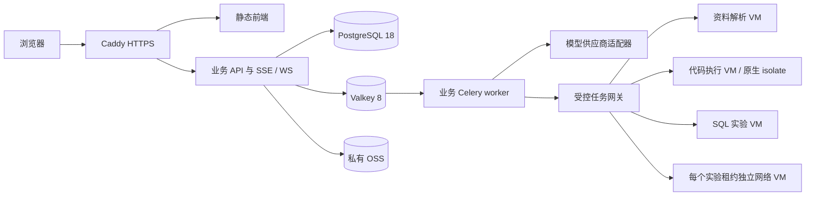

# 部署、隔离执行与运维设计

版本：v1.0

日期：2026 年 10 月 3 日

状态：已选定的开发与发布设计基线；未安装、部署、容量测试或执行安全验收。锁文件、镜像清单和实测记录在对应实现阶段产生。本文件不表示现有服务器已具备这些环境。

## 1 部署路线与范围

业务采用模块化单体，使用 Linux、Docker Engine 和 Compose；初期不引入 Kubernetes。前端构建产物由 Caddy 提供，Python 3.13 API 与业务异步 worker 使用同一代码库和镜像，PostgreSQL 18 为权威业务数据库，Valkey 8 为队列及短期缓存。容器只对受信业务服务提供包装，不作为公开学生执行环境的充分隔离边界。

新平台有独立域名、配置、数据目录及发布流程。现有旧项目、旧数据库和服务器 Docker 服务保持独立；不得把学生代码、SQL 实验或网络节点直接放到已有生产业务宿主机。本次只读核对的旧服务器为 2 个逻辑 CPU、约 1613 MiB OS 可见内存，40 GiB 根盘使用约 78%、仅约 8.3 GiB 可用，旧服务仍在运行；这是本次观测值，不是可承载新系统的容量证明。它只适合保留旧服务及经资源检查的静态演示，不作为 PG＋OCR／embedding＋业务与实验合并部署基线。没有采购／迁移决定。

资料、代码、SQL、网络任务在独立于业务宿主机的执行环境中处理。开发期按需要启动，不要求为了页面原型同时购置所有节点。公开发布前，各活动声明的真实工具能力必须完成适配与安全验收；未验证工具显示明确限制，不能显示已通过实操。

## 2 服务清单与 Compose 分组

`gateway`、`api`、`worker`、`scheduler`、`postgres`、`valkey`、`migration` 属于业务 Compose。`embedding` 属于独立资料 VM 的 Compose／服务组，不随业务一键启动到同一宿主。执行网关对接的原生 isolate 和网络 VM 生命周期另有系统服务与模板，不硬塞入业务 Compose。

| 服务 | 职责与数据 | 暴露与限制 |
|---|---|---|
| `gateway` | Caddy 2，静态前端、TLS、反向代理、有限访问日志 | 对外 TCP 80／443；管理端口不公开；SSE 不整段缓冲，WS 透传；不缓存授权资料和答案 |
| `api` | FastAPI 业务接口、授权、同步、资源下载代理、SSE／WS 会话 | 容器网络内 8000；不映射公网端口；非 root、只读根文件系统、按需临时目录 |
| `worker` | Celery 5，账号模式 Agent 运行、索引生成、业务核验和任务调度 | 无入站公网端口；不在自身进程解析不可信 Office／PDF 或运行学生程序 |
| `embedding` | 独立资料 CPU worker 上的 BAAI/bge-m3 dense 1024 维向量服务 | 仅内部接口；不与 API／PG 同宿主抢占资源，不与不可信解析容器共进程；任务受限且输入先过授权 |
| `scheduler` | 唯一一个调度实例，投递 outbox、对账超时、回收临时对象 | 仅调度幂等操作；不以定时器内存作为权威状态；不得启动多个同名调度器重复计费 |
| `postgres` | PostgreSQL 18＋pgvector 0.8，业务表、检查点及可重建检索索引 | 容器网络内 5432，不映射公网；迁移、API、只读诊断使用不同数据库角色 |
| `valkey` | Valkey 8，Celery broker、短期缓存、速率限制、运行取消通知 | 容器网络内 6379，不映射公网；ACL／密码，AOF，队列库禁淘汰，缓存独立命名空间和 TTL |
| `guest-runtime` | 访客Agent／RAG／runner的短期lease、临时事件与任务协调 | 独立无AOF／RDB临时存储或受限内存／tmpfs；正文／checkpoint不入PG、主broker或备份；无公网直连，重启按失效处理 |
| `migration` | 同一业务镜像，执行已审阅的 Alembic 迁移 | 仅发布时运行；不随每个 API 副本自动迁移 |

前端构建使用 Node.js 24 LTS；生产浏览器应用不依赖服务器 Node 运行。后端运行与学生 Python 环境分开：后端 Python 3.13 标准 GIL 版；学生语言版本由课程运行环境清单固定，不随业务升级改变旧尝试。

内部业务网络与执行管理网络分离。禁止给业务 API／worker 挂载 Docker socket、宿主机根目录或 isolate 特权。Compose `depends_on` 只帮助启动，服务还须就绪检查、数据库迁移版本检查、退避重试及异常降级；数据库不可用时不能声称已保存学习证据。

Caddy 的自动证书需要域名 DNS、80／443 可达及持久的数据目录；正式发布前域名与证书必须验证，不以 HTTP 测试地址代替。[Caddy HTTPS 官方说明](https://caddyserver.com/docs/automatic-https)

## 3 卷、配置、凭据和模型接口

| 持久对象 | 用途 | 恢复依据 |
|---|---|---|
| `postgres_data` | 权威账号、课程版本、作品、权限、任务、证据、outbox、LangGraph 检查点 | 基础备份与 WAL；不得仅备份向量索引 |
| `valkey_data` | AOF／快照；短期队列状态 | 可恢复辅助数据；丢失后按 PG outbox／任务表对账，不能产生重复计费或可信证据 |
| `caddy_data`／`caddy_config` | 证书状态、Caddy 配置 | 加密配置备份；私钥限制访问 |
| 私有对象存储 | 账号原件、学生发布副本、作品附件、解析 JSON、抓包及版本化运行材料 | 对象版本与备份清单、PG 对应版本和 hash |
| 每任务临时目录 | 访客载荷、解析／编译／运行中间文件 | 不纳入常规备份；完成／取消后清理，有期限与对账；不是长期学习存储 |

非敏感配置由环境变量注入，例如 `VAULT_PUBLIC_ORIGIN`、服务地址、对象 adapter 类型、任务档位与允许模型 provider。生产秘密用宿主机受限文件或凭据服务挂载为 Compose secrets，通过 `_FILE` 读取；开发 `.env` 被 Git 忽略，仓库只放无真实值的 `.env.example`。Compose secrets 的来源文件同样需要限制宿主机访问，它不是自动提供的云密钥保险库。[Compose secrets](https://docs.docker.com/compose/how-tos/use-secrets/)

凭据按业务 DB、OSS 读写、备份、模型 provider、执行网关与管理操作分别配置；不使用云账号 root 权限。公开日志不能输出连接串、密钥、完整 prompt、私有资料正文、答案、学生源代码或临时下载凭据。管理员使用 SSH 密钥／受限管理路径；本文件不保存已有服务器密码。

模型使用 provider adapter，配置能力、模型 ID、调用超时、用量记录、错误映射和数据外发边界。首家接入选择DeepSeek deepseek-flash、独立httpx provider网关，详情见 [技术基线](TECHNOLOGY_BASELINE.md)；高级模型自动切换关闭，不要求本地GPU。没有凭据时页面和规则测试可用明确标识的 stub；stub 不能生成真实核验证据或被称为 AI 已运行。外部模型不能直接访问 OSS、业务数据库或执行控制面。

访客guest-runtime不复用账号持久Celery任务／PG checkpoint：idle30min／absolute2h为开发初值，收到本地保存确认、取消或到期清除载荷和临时结果；失效后由本地作品重建。临时服务关闭持久化、正文日志、core及相应swap写入，清理／重启／失败路径须验证。访客仅本人临时材料／平台公开内容，教师受众资料要求登录。精确协议见 [物理／API](TECHNICAL_DATA_CONTRACT.md)。

## 4 账号队列、幂等与可信记录

选 Celery 5 的 Redis transport 配合 Valkey 8；Celery 官方提供 Redis broker，Valkey 官方说明 RESP 协议兼容现有 Redis 客户端。因此本项目将该组合纳入实现基线，但仍要验证锁定版本的实际投递、断连、重投、延迟任务、取消和恢复行为；这不是官方对项目配置的容量保证。[Celery Redis transport](https://docs.celeryq.dev/en/stable/getting-started/backends-and-brokers/redis.html)、[Valkey 兼容性](https://github.com/valkey-io/valkey-doc/blob/main/topics/migration.md)

Celery 只传 `operation_id`、任务类型和版本等小消息，不传整份教学资料。序列化只接受 JSON，禁止 pickle；broker 不能被浏览器或学生节点访问。任务分为受信 `agent`、`index`、`dispatch` 队列，耗时 Office／编译执行由对应隔离控制器处理，不在通用 worker 内兜底执行。

业务事务同时写任务记录与 outbox；投递成功不意味着执行成功，投递丢失由对账补偿。worker 取得带期限的任务租约，再按稳定 `operation_id` 调模型／网关，完成结果先在数据库事务内提交，再确认消息。采用至少一次处理语义；不能宣称 Celery 保证外部动作 exactly-once。重复计费、作品创建和证据写入依赖数据库唯一约束、幂等账本和结果版本检查。

不启用 Celery result backend 作为可信业务记录。账号模式的任务状态、执行摘要、核验事件和取消最终结果在PG；访客仅在GuestLeaseStore短期处理并返回本地，不能进入该永久账本。模型输出与stdout不等于达标记录。设置合理 `visibility_timeout`、消息TTL、预取和deadline；账号学生等待写业务等待状态并释放worker，访客等待返回本地。`acks_late`须配幂等与对账，崩溃重投要实测。[Celery任务](https://docs.celeryq.dev/en/stable/userguide/tasks.html)

取消由权威任务状态、取消通知、网关终止和结果提交前复核共同实现；仅调用队列 revoke 不能算资源已回收。权限撤销后恢复、开始下一节点、交给工具及发出内容前重新授权；缓存与运行检查点不延长权限。

## 5 资料解析与对象存储

### 5.1 解析执行选择

选择 Docling 的本地 CPU 路线处理 PDF／DOCX／PPTX 等结构；旧 `.ppt` 先在隔离环境中用 LibreOffice 转为 PPTX，再进入同一流程。TXT／Markdown 使用受限文本解析器。Docling 许可为 MIT，实际模型权重、OCR 组件、字体和 LibreOffice 依赖单独登记许可。格式受支持不代表每个图表、公式和扫描页准确，教师需预览原页定位与解析缺漏。[Docling 格式](https://docling-project.github.io/docling/usage/supported_formats/)、[Docling LICENSE](https://github.com/docling-project/docling/blob/main/LICENSE)、[CPU 与模型离线设置](https://docling-project.github.io/docling/reference/pipeline_options/)

解析控制器部署到业务之外的专用Linux VM，取得单任务输入／上传权限；解析容器按任务创建，`network=none`、无控制面凭据／Docker socket，仅允许该任务输入只读与专属输出挂载，禁止其他宿主目录。CPU／内存／进程／磁盘／墙钟受限。模型、OCR和字体在构建阶段预取锁hash；控制器的内部受限网络不代表解析容器可联网。

Office 转换使用每任务独立配置目录；禁止宏、外链更新和脚本，采用 UNO 文档载入的 `MacroExecutionMode=NEVER_EXECUTE`，禁止用无参数的普通打开方式替代。关闭网络仍不能替代禁宏与文件范围限制。压缩包总展开大小、文件数量、层级、页数与 XML 实体受限，坏文件、超限和安全拒绝返回解析状态，不转成课程内容错误。[LibreOffice 宏执行模式](https://api.libreoffice.org/docs/idl/ref/namespacecom_1_1sun_1_1star_1_1document_1_1MacroExecMode.html)

PPTX 元信息适配器使用 python-pptx 与受限 OOXML 检查，显式检查备注、隐藏页、嵌入对象和外部关系；python-pptx 有 notes API，但不宣称一个 API 可以完整发现所有敏感内容。学生版本默认移除备注和隐藏页及未允许附件，生成独立副本供教师预览、确认，再解析和发布；原件授权不能因副本发布改变。[python-pptx notes](https://python-pptx.readthedocs.io/en/latest/dev/analysis/sld-notes-slide.html)

默认 embedding 采用 BAAI/bge-m3 的 dense 1024 维输出，按锁定 revision 本地 CPU 加载，不将私人资料外发给向量服务商；暂不启用 sparse／ColBERT 或 GPU。embedding 服务单独进程与受限队列，查询优先于批量建索引；在资料 VM 上按实际内存预算错峰运行 Docling／OCR 与 embedding，不能在 2 GiB 业务服务器同时塞入整套模型、API 和 PG。CPU 延迟／相关性需中文课程样本实测，OOM／排队／超时属于工具异常，不算学生答错。[BAAI 官方模型卡与许可](https://huggingface.co/BAAI/bge-m3)

### 5.2 对象存储选择

开发采用 `FileBlobAdapter`，文件在专属本地目录，受同一授权 API 管理；明确不用于公开生产附件服务。第一阶段发布选阿里云 OSS 私有桶，打开阻止公共访问，业务 adapter 提供 put／get／delete／stat 接口，保留后续其他云或私有部署实现。当前 OSS 区域、bucket 和 RAM 凭据尚未开通，不发生采购或远端写入。选择托管 OSS 是为减少独立存储集群运维，不代表云存储能代替业务资料 ACL。[OSS 权限官方说明](https://help.aliyun.com/zh/oss/user-guide/permissions-and-access-control-overview)

教师资料与受控答案由业务 API 代理下载：每次请求及继续分段读取按资源绑定、当前受众与答案策略核查；`Cache-Control: private, no-store`，不做公共 CDN 缓存，不把仍有效的 OSS 直链交给学生绕过撤权。浏览器已经收到或另存的内容无法收回。上传第一版同样经 API 流式接收与总大小限制，避免因直传凭据提前开放越权写入。对象 key 是随机不可枚举 ID，内部路径不充当权限。

索引源 hash、解析配置、模型、embedding 和切片版本留存于数据库；索引可重建，ACL 是权威记录。教师关闭学生可见后，立即阻断后续检索／下载／流式内容发出，再异步清除索引、缓存和上下文。访客临时材料不进入账号桶永久区，也不进入例行备份。

未选择 MinIO 社区仓库作为新生产基线：截至本次核对其官方 GitHub 仓库已经归档；采用归档软件或未验收 fork 增加维护责任，不适合当前少量开发人员的默认路线。该判断针对本次新系统选型，不修改或否定已有部署。[MinIO 官方仓库现状](https://github.com/minio/minio)

## 6 代码、SQL 与数据实验

### 6.1 普通代码

专用 Linux VM 上原生运行 isolate，cgroup v2、受维护内核不低于其功能要求、无 swap，`isolate.service` 配合每次独立 box。API 与业务 Compose 不运行 isolate；每任务编译和执行均隔离，源文件、工具链和所需库按允许目录挂载，禁止继承 worker 凭据或完整环境。默认关闭外网，依赖由模板预装，学生不能在线安装任意包。[isolate 官方要求及限制](https://www.ucw.cz/isolate/isolate.1.html)

任务输入由服务端选择模板、语言标准、环境版本、文件清单和资源档位；浏览器不能提交任意宿主命令、挂载、编译路径或 box ID。结果携带真实退出状态、CPU／墙钟、内存、stdout／stderr 截断、环境版本、输入作品 hash、nonce 和采集时间，经窄权限控制器提交，业务层核对当前任务版本后才核验。isolate 的执行元文件在学生目录外，学生 stdout 中写入伪造 JSON 不会成为元数据。

本地和服务端 core dump、日志、临时目录及异常包全部纳入清理；Linux `systemd-coredump` 可以独立保存 core，不能只设 isolate `--core=0` 就认定无副本。出现逃逸／清理异常先隔离节点，不让后续学生复用该环境。

### 6.2 SQL 与数据

SQL 是专用实验 VM 内的临时 PostgreSQL 18 实例／容器，绝不连接业务 PG。学生仅在自身实验中取得必要数据库权限；管理角色、宿主卷、扩展、文件／程序执行、外部网络和复制接口受限。每实验限定语句时间、锁等待、连接、数据容量及外层 deadline。只限制 SQL `statement_timeout` 不足以限制完整环境。

每次实验保存建库模板、提交脚本、schema／结果快照及检查依据，使用隔离后可重建的临时数据卷；对其他学生／业务数据的查询必须真实拒绝。数据库课程中需要高权限的管理活动单列模板和权限，在租约独占的隔离 VM 内实现，不能为了演示给业务库超级用户权限。

AI／ML 采用 CPU 小数据实验，固定依赖、数据版本、随机种子和检查规则，复用已验收代码／数据执行 adapter。预装依赖、图像与数据输出按课程档位核对，不要求 GPU；需要 GPU 或大型数据的活动明确标记环境限制并单独设计。

## 7 网络实验底座与边界

选择 containerlab＋经审校 Linux／FRR 节点作为基础网络底座，平台自行实现浏览器拓扑、xterm.js 终端、授权网关、配置快照、TShark 定向抓包和版本化检查器。不并行集成 Mininet／Containernet／Kathara。选择理由是声明式拓扑与节点生命周期便于复现；教学核验、过程记录及权限仍是本平台责任。[containerlab Linux 节点](https://containerlab.dev/manual/kinds/linux/)

containerlab 控制器具有很高宿主权限，默认节点 `privileged` 可能为 `true`，所以不得把学生提交的原始拓扑文件直接交给它。平台只接受白名单模板与有限字段，对每个节点显式 `privileged:false`，固定镜像 digest，拒绝宿主挂载、Docker socket、host PID／network、任意设备、任意 image 和主机命令。确需 NET_ADMIN／NET_RAW 等能力的模板逐项确认，不能因容器工具能部署就声称它具备恶意多租户安全。[containerlab 安装与控制权限](https://containerlab.dev/install/)、[节点 privileged 默认](https://containerlab.dev/manual/nodes/)、[Docker 安全边界](https://docs.docker.com/engine/security/)

内部自测使用专用网络 VM，一次只租给一个实验／一个使用者，结束后销毁或回到已验收干净基线；禁止与代码、SQL、资料解析、业务服务共宿主。对外发布采用 **每个实验租约独立 VM**（可以是预热 VM 池）作为宿主隔离边界，每 VM 同时一个学生 lab；学生子网不能到达管理网、云元数据、业务网络或公网。控制器经独立管理通道处理，终端只通过授权 WS 网关接入指定节点。

VM 池不足时排队，不把其他学生的实验塞进同宿主容器来提高“并发”。租约结束后导出个人配置和证据，销毁／重建 VM，验证无遗留进程、路由、文件、凭据和抓包后才重新纳入池。没有 VM 生命周期与隔离验收时，仅开放受控内部验证，不能宣传已开放安全多人网络实验。

首个模板为两台主机和两个路由节点：地址／静态路由／双向连通与 ARP／ICMP 观察；之后按课程蓝图增加 DNS、TCP、路由等模板并逐个验收。FRR/Linux 不等同华为 VRP 或 Cisco IOS；厂商专有 CLI、设备行为和镜像需另行授权和适配，不能伪造其结果。

过程证据以配置／状态快照、检查器结果和原始报文为主，终端回放为辅助。自由终端输入不保证逐命令退出码；受控命令 API 才能结构化记录。学生、Agent、系统动作分别留痕，Agent 修复不能作为学生独立完成。

## 8 测试资源初值与容量门

| 测试节点 | 初始资源预算 | 最初开放方式 |
|---|---|---|
| 业务 VM | x86_64，4 vCPU／8 GiB，80 GiB SSD | API＋worker＋PG＋Valkey；只作为测试初值，不承诺在线人数 |
| 代码执行 VM | x86_64，4 vCPU／8 GiB，80 GiB SSD | 最初一个编译／运行任务；核验峰值后调整 |
| 解析 VM | x86_64，4 vCPU／8 GiB，40 GiB SSD | 最初一个文档解析；扫描件／大 PPT 单独测量 |
| SQL 实验 VM | x86_64，2 vCPU／4 GiB，40 GiB SSD | 最初一个实验，独立临时 PG |
| 每个网络实验 VM | x86_64，2 vCPU／4 GiB，40 GiB SSD | 小 Linux／FRR 模板一个租约；实际模板峰值决定是否增配 |

这些是逻辑部署单位及信任边界对应的测试资源预算，不是必须一次购买若干台机器的清单；可在受控开发虚拟化环境中按阶段启动。允许受信 worker 与业务服务合并；允许资料控制器按内存预算顺序执行解析和 embedding；学生实验不得与业务、资料或备份共享执行宿主内核。独立备份 repository 主机按备份量规划，本次尚未选实际主机或采购。业务若后续把 PG 迁往托管数据库，数据接口保持不变；容量或恢复测量失败则拆分／增配，而不是用纸面配置宣称支持人数。

代码默认测试档位：普通运行总内存 512 MiB、CPU 3 秒／墙钟 10 秒；Java 总内存 1 GiB，线程和堆另限；小编译内存 1 GiB、CPU 10 秒／墙钟 30 秒。输出最多 1 MiB、普通输入 1 MiB、临时文件总量 64 MiB。SQL 初值语句 5 秒、锁等待 1 秒。网络／数据活动用专属启动、收敛、运行、抓包、闲置和总租约预算，不能套短代码 deadline。

原型上传初值为每文件 50 MiB、500 页／幻灯片、压缩展开总量 200 MiB；解析总墙钟 300 秒，失败明确可重试。正常教材／大纲样本与恶意样本验证后调整档位，不能默默截断资料然后声称课程完整。所有任务服务端总预算、用户／访客速率、排队上限与超限状态统一生效。

上线前测量普通读写、资料解析、Agent 延迟与预算、编译峰值、SQL／网络实验、撤权、取消、重投、断连、磁盘不足、临时数据回收和跨会话恢复。只有通过的具体模板／资源档位才写入支持清单，公开并发与服务容量依据实测，当前没有验证结果。

## 9 备份、恢复、发布和回滚

权威PG使用pgBackRest基础备份＋WAL，首版在业务宿主之外的独立备份主机POSIX repository，经TLS／SSH并客户端加密。备份凭据不授予在线业务API／主OSS桶访问权；备份本身含课程、切片和学习记录，正文加密并限制访问。备份不得共宿主于学生执行／解析。不假定pgBackRest S3天然兼容OSS，不配置未验证接口。课程、ACL、作品、证据、幂等账本与账号checkpoint不能用索引重建替代；校验WAL连续和备份可读，上线前完整恢复。[PG PITR](https://www.postgresql.org/docs/18/continuous-archiving.html)、[pgBackRest配置](https://pgbackrest.org/configuration.html)

账号对象采用不可变版本 key、hash 与版本 ID，OSS 版本控制不能单独当灾备。新增版本通过可靠 outbox 在 5 分钟调度窗口内复制到隔离备份桶，异常告警并重试；每日生成完整数据／对象清单对账。对象主存储写入失败不能提前提交“附件已同步”。备份生命周期、删除请求和到期清理统一纳入对账；访客载荷不得通过这些备份变为长期档案。备份保留与账号删除期限在数据留存规则中固定，不能无限期保留教师／学生私有资料。

上线恢复验收目标：权威数据库和账号对象备份 RPO 不超过 15 分钟，端到端 RTO 不超过 4 小时；对象新版本在数据库确认同步之前已经写入主对象存储，备份恢复后按清单验证缺失和 hash。跨桶增量复制时延和恢复缺失附件须实测，不能只靠主桶持久性推导已达标。上述是验收目标，当前未测试达成。每日备份检查、每月恢复演练，并在重大数据库／对象 adapter 升级后追加演练。

发布顺序：构建和扫描固定镜像 → 创建数据库／配置恢复点 → 可兼容的扩展迁移 → 更新 API／worker → 健康检查与访客学习／登录同步／资料撤权／真实执行冒烟 → 切换入口 → 观察队列与错误。排空或冻结变更中的任务类型，旧流程按其版本恢复，不将旧 checkpoint 强灌新图定义。

回滚先阻止新写入与危险任务，回退兼容的应用 digest。破坏性迁移不能只换旧镜像；需前滚修复或按审核恢复点恢复并明确可能的数据损失。课程和资料的已发布版本不覆盖，问题发布撤回并发布修订。备份和回滚记录至少包含版本、时间、操作负责人、恢复点、检查结果和限制，不填造“通过”。

## 10 版本锁定与完成条件

当前固定版本线：Python 3.13、PostgreSQL 18、pgvector 0.8、Valkey 8、Celery 5、Caddy 2、Node.js 24 LTS；isolate、containerlab、FRR、Docling、LibreOffice 和各学生工具链在首个实际镜像构建时选择受维护版本。不是长期使用 `latest`：每次发布包含 `uv.lock`、前端锁文件、操作系统包清单、镜像 digest、解析／embedding 模型 hash、课程环境 ID 和数据库迁移版本。

补丁锁定须真实安装／构建并通过依赖兼容、功能、安全与恢复检查，再记录精确值。本次没有执行这些工作，不填写虚假的锁版本或 SBOM。升级保留旧尝试的环境信息，已有证据不会因为镜像变化被静默改写。

开发可以按本基线实现配置和 adapter；公开发布必须有隔离执行验收、RAG 权限与撤权测试、访客清理对账、全课程覆盖、容量记录、备份恢复和回滚记录。未通过时仍为测试环境，不把设计文件当运行结果。
