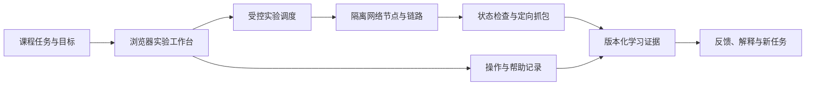

# 网络课程实验工作台设计

日期：2026 年 10 月 2 日。

状态：设计方案与官方资料研究，尚未部署、运行或验证。基础实操与证据方案纳入需求草案，底座、镜像、具体协议模板与资源配置待原型选择。

## 1 学生只用浏览器，实验在服务端运行

网页提供拓扑、节点终端、配置、报文查看、任务与检查结果；独立实验执行环境运行网络节点和通信。学生可以实际改地址、配置路由、启动受控服务、观察协议并排查故障，操作结果来自实验网络。

通用协议原理与厂商操作分开。Linux、开放路由软件和受控服务可以构成通用课程实验；课程若要求华为 VRP、Cisco IOS 的专有命令、界面或设备行为，就需要经许可的对应镜像、软件或真实设备。平台可接入远程终端或桌面，但不能用通用节点宣称已经等同厂商设备。

纯网页动画适合展示协议原理，应标明模拟规则；它与服务端真实协议栈和流量实验分别标识。只画出拓扑或让 AI 生成命令输出，不计为实操。

## 2 候选底座与适用范围

| 候选方案 | 官方能力 | 本项目适合借鉴的部分 | 需要补充或注意 |
|---|---|---|---|
| containerlab 配合 Linux／FRR 节点 | 拓扑文件、节点生命周期、正式 Web GUI、终端和抓包接口 | 浏览器拓扑操作、实际路由与链路实验 | 服务端仍需 Linux 和容器环境；浏览器 editor sandbox 不执行实验；配置保存依节点类型实现 |
| Kathara 配合 Lab Checker | 网络场景、CLI／Python API、检查配置与通信 | 课程模板、可重复任务、接口和路由等规则核验 | 核心不是开箱浏览器教学平台，需增加网页、会话、证据和权限层 |
| Mininet | Linux 协议栈与应用、OpenFlow、拓扑和链路参数 | TCP、SDN、带宽和时延条件的实验 | 默认网络命名空间不是完整多用户隔离，进程与文件系统边界需另外设计 |

依据：[containerlab GUI 与运行端](https://containerlab.dev/manual/gui/)、[Kathara](https://github.com/KatharaFramework/Kathara)、[Lab Checker](https://github.com/KatharaFramework/kathara-lab-checker)、[Mininet 概览](https://mininet.org/overview/)、[Mininet 隔离说明](https://mininet.org/walkthrough/)。

建议先用 Linux 节点和开放路由组件做小拓扑，比较 Kathara 的课程检查契约与 containerlab 的浏览器接入；不同时集成全部底座。FRR 可用于路由协议配置与观察，具体协议和版本需按模板验收。[FRR OSPF 文档](https://docs.frrouting.org/en/latest/ospfd.html)

底座的开放许可不自动包含厂商镜像的使用权，实际采用组件、镜像和远程软件时分别核对版本与许可。本次未引入其代码或镜像。

## 3 不要求学生手工记下所有操作

由平台采集过程和检查点，学生补充预测、故障解释和反思。记录分层，避免把终端视频当成全部证据。

| 记录层 | 采集内容 | 主要用途 |
|---|---|---|
| 操作事件 | 实验启动、拓扑编辑、配置保存、受控命令调用、检查提交、提示请求 | 建立按任务和节点关联的时间线 |
| 终端会话 | 可采集的输入输出、时间与窗口变化 | 回放操作，保留无法结构化的交互 |
| 状态与配置 | 地址、接口、路由、邻居、运行配置及文件前后差异 | 判断实际配置和网络状态，不仅依赖键入文本 |
| 结果证据 | 双向通信、服务与协议检查、定向抓包、失败原因 | 核验任务条件，复核判断 |
| 学习证据 | 学生预测与解释、帮助程度、独立变体表现 | 区分操作合格、帮助后完成与独立理解 |

每条记录绑定学生、课程、任务版本、实验会话、节点、操作者与时间。学生、Agent 和系统自动动作分别标识；Agent 执行过的修复不能自动成为学生独立完成的证据。

### 3.1 终端记录的准确边界

网页终端的输入包含字符、粘贴、退格和交互控制，并不天然等于准确命令清单。通过受控命令 API 发起的调用可以保存命令、stdout、stderr 和退出码；自由终端保存原始会话，不保证能逐条重建命令语义和退出状态。

可参考 xterm.js 提供网页终端、asciinema 提供时间化回放、Guacamole 提供 SSH 文本和图形会话记录。xterm.js 不是 SSH 服务或实验管理器，录制组件也不会自动生成学习判断。[xterm.js API](https://xtermjs.org/docs/api/terminal/classes/terminal/)、[asciinema 录制](https://docs.asciinema.org/manual/cli/quick-start/)、[Guacamole 文本记录](https://guacamole.apache.org/doc/gug/configuring-guacamole.html#text-session-recording-typescripts)

asciinema 默认不录键盘输入；其会话退出事件也不是每条命令的退出状态。采集需要说明范围，避免口令或敏感输入进入记录；输出与抓包同样按实验范围处理，不依赖日志证明“所有操作已捕获”。[asciicast v3](https://docs.asciinema.org/manual/asciicast/v3/)

### 3.2 配置快照与抓包

在任务开始、学生提交、检查前后和关键操作点保存配置与状态，设置数量和容量限制。FRR 等节点需编写实际适配器读取运行配置和必要文件；不能假定底座的保存命令覆盖所有节点。[containerlab 保存支持范围](https://containerlab.dev/cmd/save/)、[FRR 配置与保存](https://docs.frrouting.org/en/latest/vtysh.html)

抓包限定实验接口、过滤条件和时段，保存原始 pcap／pcapng，并生成可定位的字段视图。TShark 可用于采集和读取报文，但哪些报文构成课程核验依据，需要我们设计检查规则。[TShark](https://www.wireshark.org/docs/man-pages/tshark.html)

## 4 判定配置和结果，不只判命令

一条命令曾被输入不代表执行成功；ping 通也可能没有满足指定路由、隔离或协议条件。检查器应按任务核对接口、地址、路由、邻居、服务、允许与禁止的通信，以及必要的报文行为。

Kathara Lab Checker 已提供接口地址、路由、BGP 邻居、DNS、连通性及自定义命令输出等检查契约，可以研究其声明式检查方式。其他协议、解释和学习评价仍需自定义，不能把该工具说成自动评价全部网络课程。[官方检查配置](https://github.com/KatharaFramework/kathara-lab-checker)

检查结果保存每项预期、实际状态、命令或工具输出、检查器版本、采集时间与限制。网络需要收敛时设置条件和等待范围；超时、节点异常、抓包或证据采集失败分别记录，不转换成学生能力不足。

Agent 读取授权证据后提出候选原因和提示，例如建议检查下一跳或回程路由。关键结论应回到实际查询和检查，模型不能编造设备状态。核验角色不能顺手修复学生配置并宣布学生通过。

## 5 第一个完整实验示例

建议先实现两台主机经过两个路由节点跨网段通信，不从大型厂商认证实验起步。下列为设计示例，没有实际运行结果。

1. 给定拓扑、目标网段与任务条件，让学生预测数据包路径。
2. 学生配置地址、网关和静态路由，使用终端或配置编辑器操作。
3. 系统保存配置差异，检查各节点地址、接口、路由与双向通信，观察 ARP／ICMP。
4. 未通过时显示实际失败项，辅导 Agent 按证据给提示，学生自己修改重试。
5. 学生解释为什么需要下一跳和回程路径，核对解释与实际网络。
6. 在新的尝试中改换网段或预置一个故障，检查能否独立处理；记录提示与系统动作。
7. 退出后保留任务、个人配置和证据，下次重建并重新检查，再继续后续实验。

后续逐个增加 DNS、TCP、动态路由、交换与链路故障模板。每个模板先用参考配置和故意错误配置校核检查器，记录实际支持范围。

## 6 保存配置与重建环境

持久保存模板、拓扑、镜像版本、个人配置、文件及检查点。闲置时回收执行资源，返回后按这些内容重建实验，等待必要收敛并重新检查，显示哪些状态已经恢复。

平台公共模板与镜像可长期维护；访客个人拓扑、配置、抓包和证据仅在本地持久保存，服务端只提供临时实验与下载，按期限清理。登录后可关联并同步本人记录与附件，实验资源仍按生命周期回收。容量不足或附件未取得时明确标注，不能将临时下载链接当作永久证据。[账号与同步设计](ACCOUNT_AND_DATA_DESIGN.md)

重建不会自动恢复原 TCP 连接、缓存、协议定时器或所有瞬时状态，不能称为逐字节续跑。若任务依赖短暂状态，保留观察记录，并说明需要重新执行哪一段操作。

## 7 运行和记录边界

网络底座可能需要提升权限来管理容器、命名空间和链路，应放在独立实验主机或 VM，由平台调度受控模板。学生只能操作自己的实验节点，不能获取宿主 root、通用 Docker 或业务网络访问权限。[containerlab API server 的运行边界](https://containerlab.dev/manual/api-server/)

实验节点通信与管理通道分开；限制节点数、CPU、内存、存活时间、日志和抓包大小。厂商 VM 镜像、复杂拓扑和长期服务的资源需求需实际测量，不按网页演示效果估计。

记录只覆盖实验，说明内容、保留期限、导出和删除方式。私有作品和原始终端／报文不默认提交 Git。日志缺口、时间线异常或迟到结果应可见，不能由模型补写成真实操作。

## 8 原型验收

- 浏览器可操作真实受控节点，配置会影响网络结果；纯编辑器演示不计通过。
- 正确配置、单向可达、错误下一跳、接口关闭等案例有不同且可复核的检查结果。
- 已采集事件、配置差异、状态、抓包与帮助能关联到同一个任务和作品版本。
- 自由终端不能结构化的部分有回放和明确缺口，不能虚称完整命令审计。
- 学生操作、系统检查、Agent 提示与修复能够区分。
- 退出后重建配置并重新检查；说明丢失的瞬时状态。
- 环境与证据异常保持待核验，重复检查不重复推进状态。
- 隔离、外联、资源和记录范围通过实际验证。

本次只完成方案与需求补充。下一步用一个小拓扑验证浏览器实操、自动采集、检查器、帮助与恢复的完整流程，再确定底座和模板扩展顺序。
